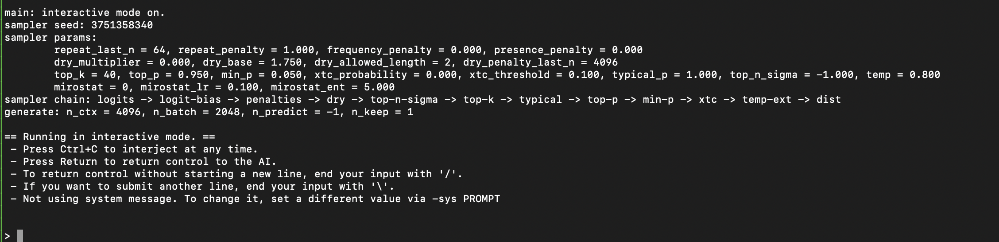
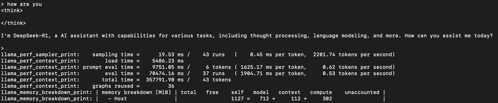

# DeepSeek on lp4a

想要在lp4a上面部署DeepSeek-R1是不现实的，因为其参数量是671B。不过可以通过蒸馏技术得到一个小模型，部署到lp4a上玩玩。

> 蒸馏(distillation)是一种模型压缩与加速技术，核心思想是用一个已经训练好的大模型去指导一个小模型学习，从而让小模型性能尽量接近大模型，但计算量、参数量、延迟都更小。
>
> 举个例子：比如一个大模型可以准确区分“猫”、“狗"、"狐狸"：
>
> * teacher输出：猫=0.8，狗=0.15，狐狸=0.05
> * 真标签：猫=1，其他=0
>
> 如果student只学真实标签，它只知道“猫=1，其他=0"；但如果它学teacher的输出，就知道狗和猫更像(0.15)而不是狐狸(0.05)
>
> 以上只是众多蒸馏方式中的一种。

首先需要下载模型文件，[https://huggingface.co/unsloth/DeepSeek-R1-Distill-Qwen-1.5B-GGUF/resolve/main/DeepSeek-R1-Distill-Qwen-1.5B-Q2_K.gguf](https://huggingface.co/unsloth/DeepSeek-R1-Distill-Qwen-1.5B-GGUF/resolve/main/DeepSeek-R1-Distill-Qwen-1.5B-Q2_K.gguf)，GGUF是一种二进制模型文件格式，其和safetensors不同的是，前者不仅存储张量数据还存储一系列标准化的元数据。

然后需要准备llama.cpp环境，其是一个用C/C++实现的LLM推理引擎，支持在CPU上部署LLM：

```shell
git clone https://github.com/ggml-org/llama.cpp.git
cd llama.cpp
mkdir build
cd build
# llama.cpp在RISC-V上有一些加速优化选项，如RVV，如果硬件支持，可以开启
cmake .. -DGGML_RVV=0 -DGGML_XTHEADVECTOR=0 -DGGML_RV_ZFH=0
make -j$(nproc)
```

编译完成后可以在build/bin下面看到编译产物llama-cli等。然后就可以运行了：

```shell
llama.cpp/build/bin/llama-cli -m ./DeepSeek-R1-Distill-Qwen-1.5B-Q2_K.gguf -t 4
```

-m选项后指定了实际模型的路径，-t 4表示使用4个线程。



因为我这里用的是openeuler，尚未适配rvv，所以推理速度相当慢：



可以看到：

* 模型采样时间(生成token的流程是：模型计算出下一个token的概率分布，采样器根据分布选择最终输出的token，与模型计算无关，仅涉及采样算法)：0.45 ms/token
* 模型加载时间(从gguf文件加载权重、初始化上下文，只执行一次)：5.4s
* prefill阶段：1625.17 ms/token；decode阶段：1904.71 ms/token
* graphs reused(类似cudagraph，直接服用录制好的计算图，减少冗余计算等)：36次
